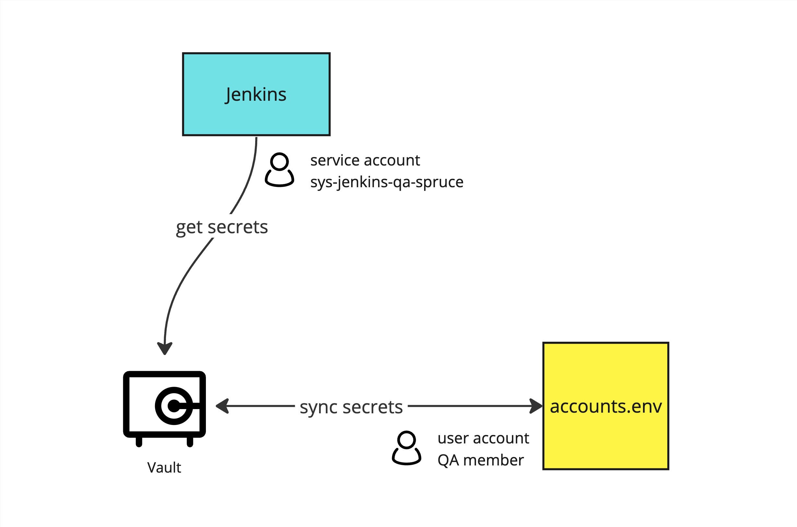

# Setup test account credentials in Vault

To make testing accounts easy to review and also keep the credentials from source control system, we store the credentials in Vault.

repo: <https://bitbucket.org/plaxieappier/aixq_benchmark>

**Prerequisite**

- Vault CLI (download with instruction <https://bitbucket.org/plaxieappier/k8s-kits/src/master/#markdown-header-vault-toolkit>)

## High-Level Structure



We save the `accounts.env` credentials in QA Vault:

```shell
VAULT_ADDR=https://vault.appier.us/ vault kv put \
  secret/project/qa-aiqua/test-accounts `cat accounts.env`
```

To make Jenkins possible to access Vault, we setup a service account based on infra teams' practice — see <https://bitbucket.org/plaxieappier/ankh/src/master/approle/> for detailed steps.

```groovy
steps {
  sh 'pip install -r requirements.txt'
  echo "Getting account credentials from vault..."
  sh 'VAULT_TOKEN=$(vault write -field=token auth/approle/login role_id=${VAULT_ROLE_ID} secret_id=${VAULT_SECRET_ID}) make get-accounts'
}
```

`VAULT_TOKEN` is an environmental variable which makes you access Vault in the shell command. You can get the temporary token with:

```shell
VAULT_TOKEN=$(vault write -field=token auth/approle/login role_id=${VAULT_ROLE_ID} secret_id=${VAULT_SECRET_ID})
```

## How to Use

### As a User

Just get the `accounts.env` from Vault. The script is written in Makefile so you can just use `make get-accounts`.

### As an Account Contributor

Remember to sync your local `accounts.env` if modified. The script is written in Makefile so you can just use `make update-accounts`.
